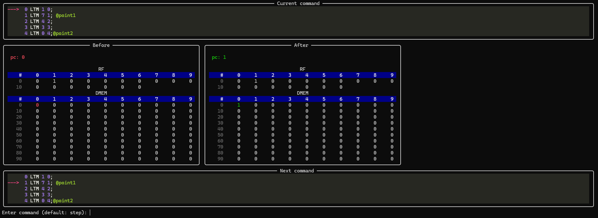

# InstrToBinTranslator — Транслятор и Отладчик для Verilog CPU



Инструментарий **InstrToBinTranslator** — это набор Python-утилит для подготовки, трансляции и отладки программ для собственного процессора.  
Он позволяет писать программы в ассемблероподобном виде, преобразовывать их в бинарный формат (`program.mem`) и выполнять пошаговую симуляцию с визуальной отладкой.

## Оглавление

- [InstrToBinTranslator — Транслятор и Отладчик для Verilog CPU](#instrtobintranslator--транслятор-и-отладчик-для-verilog-cpu)
  - [Оглавление](#оглавление)
  - [Структура проекта](#структура-проекта)
  - [Быстрый старт](#быстрый-старт)
    - [Установка зависимостей](#установка-зависимостей)
    - [Запуск транслятора и отладчика](#запуск-транслятора-и-отладчика)
  - [Файлы программы](#файлы-программы)
  - [Команды отладчика](#команды-отладчика)
  - [Визуализация](#визуализация)
  - [Система команд процессора](#система-команд-процессора)
  - [Форматы операндов](#форматы-операндов)

## Структура проекта

```
InstrToBinTranslator/
├── example/
├── activate.bat
├── install.bat
├── run.bat
├── requirements.txt
├── main.py
```

## Быстрый старт

### Установка зависимостей

Перед запуском установите необходимые пакеты:

```bash
install.bat
```

или вручную:

```bash
pip install -r requirements.txt
```

### Запуск транслятора и отладчика

Основной скрипт для работы — **`run.bat`**
Он запускает приложение, которое:

- считывает исходную программу ([`example/program.txt`](./example/program.txt));
- выполняет трансляцию в бинарный файл (`program.mem`);
- позволяет запустить симуляцию и отладку.

Пример ручного запуска:

```bash
python main.py
```

После этого откроется **консоль отладчика**, в которой можно выполнять команды (см. ниже).

## Файлы программы

- **Исходный файл:** `program.txt` — содержит текст программы в ассемблероподобной форме
- **Результат трансляции:** `program.mem` — бинарное представление, загружаемое в Verilog-модель

Пример:

```
LTM 5 0
LTM 7 1
SUB 1 0 2
JMP 3
NOP
```

## Команды отладчика

| Команда           | Описание                          |
| ----------------- | --------------------------------- |
| `next`            | Выполнить одну инструкцию (шаг)   |
| `ap`, `all-point` | Выполнить до любой точки (`@имя`) |
| `@<имя>`          | Выполнить до указанной точки      |
| `def <команда>`   | Установить команду по умолчанию   |
| _(пустая строка)_ | Выполнить команду по умолчанию    |
| `help`, `?`       | Показать справку                  |

## Визуализация


## Система команд процессора

| Команда     | Описание                                                                 | Формат                                | Псевдокод                                          |
| ----------- | ------------------------------------------------------------------------ | ------------------------------------- | -------------------------------------------------- |
| `NOP`       | Ничего не делать                                                         | [OpCode]                              | void do(){}                                        |
| `LTM`       | Загрузить литерал в память                                               | [OpCode][literal][adr_m]              | mem[adr_m] = literal                               |
| `MTR`       | Загрузить значение из памяти в регистр                                   | [OpCode][adr_r1][adr_m1]              | RF[adr_r1] = mem[adr_m1]                           |
| `RTR`       | Загрузить значение из регистра в регистр                                 | [OpCode][adr_r1][adr_r2]              | RF[adr_r1] = RF[adr_r2]                            |
| `SUB`       | Вычитание                                                                | [OpCode][adr_r1][adr_r2][adr_r3]      | RF[adr_r3] = RF[adr_r1] - RF[adr_r2]               |
| `SUM`       | Сложение                                                                 | [OpCode][adr_r1][adr_r2][adr_r3]      | RF[adr_r3] = RF[adr_r1] + RF[adr_r2]               |
| `JMP`       | Безусловный переход                                                      | [OpCode][adr_to_jump]                 | pc = adr_to_jump                                   |
| `JUMP_LESS` | Условный переход                                                         | [OpCode][adr_r1][adr_r2][adr_to_jump] | if (RF[adr_r1] >= RF[adr_r2]) { pc = adr_to_jump } |
| `MTRK`      | Загрузить регистр из памяти по адресу, хранящемуся в регистре            | [OpCode][adr_r1][adr_r2]              | RF[adr_r1] = mem[RF[adr_r2]]                       |
| `RTMK`      | Записать значение из регистра в память по адресу, хранящемуся в регистре | [OpCode][adr_r1][adr_r2]              | mem[RF[adr_r1]] = RF[adr_r2]                       |

## Форматы операндов

| Операнд       | Размер (бит) |
| ------------- | ------------ |
| `OP`          | 4            |
| `adr_m`       | 10           |
| `literal`     | 10           |
| `adr_r1`      | 4            |
| `adr_r2`      | 4            |
| `adr_r3`      | 4            |
| `adr_to_jump` | 10           |
